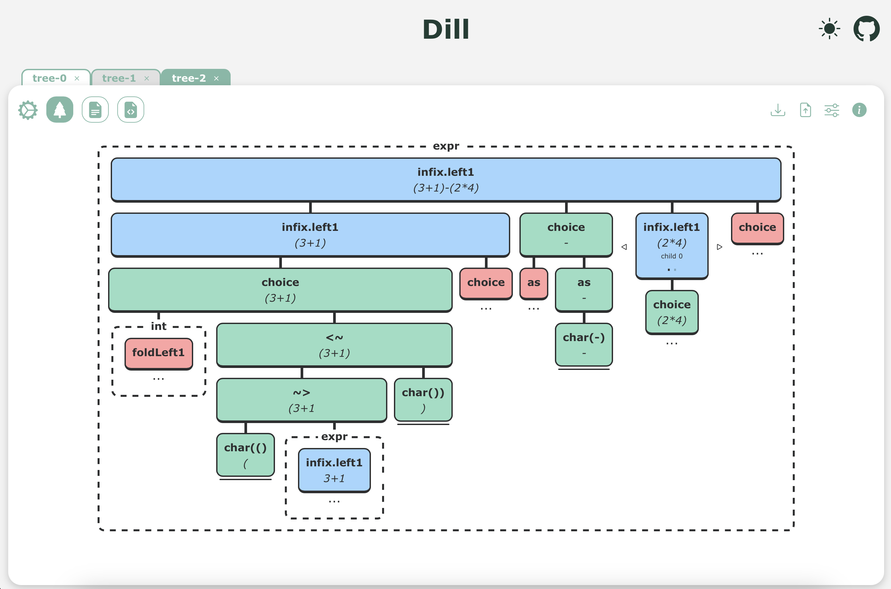

# Dill   


## What is Dill?

`Dill` (**Debugging Interactively in the Parsley Library**) is a cross-platform, visual, interactive debugger to be used with the parser combinator library for Scala, [`Parsley`](https://github.com/j-mie6/parsley).

### What features does DILL have?
- View the debug tree, input string and the parser code
- Download trees and share them with friends!
- Debug multiple instances of `Parsley` simultaneously
- Breakpoint compatibility
- State reference manipulation


## How do I install it?

`Dill` is distributed as a binary executable and can be installed below according to your machine's operating system from the [releases](https://github.com/j-mie6/parsley-debug-app/releases/) page.
To build the `Dill` debugger on your own machine, go to [building](#building).


## Usage

You will first need to [install](#how-do-i-install-it) / [build](#building) the `Dill` debugging application onto your machine. Then once the application has started, you are ready to start sending it debug information from within `Parsley`:

- First, ensure that your project has the `remote-view` project as a dependency (you will of course need to have the `Parsley` library as a dependency too).
- Import the `RemoteView` object from `parsley.debug`.
- Then on the parser which you would like to debug, attach `RemoteView.dill` before calling `parse()`.

**`test.sc`**: the following `scala` script uses `Parsley 5.0.0-M14`

```scala
//> using repository sonatype-s01:snapshots

//> using dep com.github.j-mie6::parsley:5.0.0-M16
//> using dep com.github.j-mie6::parsley-debug:5.0.0-M16
//> using dep com.github.j-mie6::parsley-debug-remote:0.1.0-M3
//> using options -experimental

import parsley.debug.*
import parsley.state.*
import parsley.quick.*
import parsley.syntax.character.{charLift, stringLift}
import parsley.debug.combinator.*

import scala.annotation.experimental

@experimental @parsley.debuggable
object Parser {
    import parsley.character.digit
    import parsley.expr.{InfixL, Ops, precedence}

    /* Expression parsing */
    val natural: Parsley[Int] = digit.foldLeft1(0)((n, d) => n * 10 + d.asDigit)
    val hello: Parsley[Unit] = ('h' ~> ("ello" | "i") ~> " world!").void

    val int: Parsley[BigInt] = satisfy(_.isDigit).foldLeft1(BigInt(0))((acc, c) => acc * 10 + c.asDigit)

    lazy val expr: Parsley[BigInt] = precedence[BigInt](int, char('(') ~> expr <~ char(')'))(
        Ops(InfixL)(char('*') as (_ * _), char('/') as (_ / _)),
        Ops(InfixL)(char('+') as (_ + _), char('-') as (_ - _))
    )

    /* Breakpoints in a short sequence */
    lazy val seq = (string("a").break(ExitBreak) ~> string("b")).break(ExitBreak) ~> string("c")

    /* Iterative example */
    lazy val xyxyxy = many("x" ~> "y")

    /* Double XML tags */
    val openTag = (atomic('<' <~ notFollowedBy('/')))

    val aTagLeft = openTag ~> "a" <~ '>'
    val bTagLeft = openTag ~> 'b' <~ '>'

    val xml = aTagLeft.fillRef { r1 =>
        object Ref1Codec extends RefCodec {
            type A = String
            val ref: Ref[A] = r1
            val codec: Codec[A] = summon[Codec[String]]
        }
        bTagLeft.fillRef { r2 =>
            object Ref2Codec extends RefCodec {
                type A = Char
                val ref: Ref[A] = r2
                val codec: Codec[A] = summon[Codec[Char]]
            }
            char(' ').break(ExitBreak, Ref1Codec, Ref2Codec) ~> ("</" ~> r2.get.flatMap(char) <~ '>')
        } <~> "</" ~> r1.get.flatMap(string) <~ '>'
    }
}

Parser.expr.attach(RemoteView.dill).parse("(3+1)-(2*4)")
Parser.seq.attach(RemoteView.dill).parse("abcd")
Parser.xyxyxy.attach(RemoteView.dill).parse("xyxyxyxyxyxyxyxyxyx")
Parser.xml.attach(RemoteView.dill).parse("<a><b> </B></A>") // Fails unless "A" and "B" are passed back by the user


```

_To run this snippet, simply run_ `scala test.sc`.

You will then be able to view a representation of the abstract syntax tree generated by `Parsley`:



The `RemoteView` object creates instances of a generic `RemoteView` interface which sends debug trees to a target over HTTP. To create an instance for Dill running locally attach `RemoteView.dill`, or if hosted externally attach `RemoteView.dill(address)`.

## Building

The frontend of the application is written using [`ScalaJS`](https://www.scala-js.org/) and [`Laminar`](https://laminar.dev/), and uses the `sbt` build system, the frontend compiles down to a single `JavaScript` file located in `./static`. The backend uses the [`Tauri`](https://v2.tauri.app/) package to host the frontend, and the [`Rocket`](https://rocket.rs/) package to host a server to receive the tree from `Parsley`. We use `npm` to manage the various packages.

**To run the project, execute `sbt run`:**

This will install the node packages required to build the project, build the front and backend, and then start the generated executable.

**To run the project in development mode, execute:**
- `sbt ~buildFrontend` to start the sbt frontend development server.
- `sbt runBackend` in a different terminal to start the [`Tauri`](https://v2.tauri.app/) app in development mode.

_This will cause a quick-reload when any of the source files are modified._

**To bundle the application for release, use `sbt build RELEASE=TRUE`:**

This generates a packaged tauri application that is built into the `/backend/target/release/bundle` (you may need to run this in sudo for the bundler to function properly, in non-sudo mode you can still generate the application).


## Bug Reports

If you encounter a bug when using `Dill`, please try to make a self contained example: this will help to identify the issue.
Then, create a new [issue](https://github.com/j-mie6/parsley-debug-app/issues) - if possible, please include screenshots and a description of the bug.


## How does it work?

- The `remote-view` backend for `parsley-debug` posts the debug tree from the parser to the [`Rocket`](https://rocket.rs/) HTTP server running within the `Dill` debugger.
- The [`Rocket`](https://rocket.rs/) server transforms and passes off a representation of the debug tree to the [`Tauri`](https://v2.tauri.app/) application in `Rust`.
- [`Tauri`](https://v2.tauri.app/) then emits the debug tree to the front end.
- Upon receiving of the tree, the frontend renders the tree on the screen.


## Docker

We provide a Dockerfile that lets you modify and test the project without installing additional dependencies.

### How to use?
After building an image, you can start a container using the command `docker run -it --rm -e DISPLAY=:0 -v /tmp/.X11-unix:/tmp/.X11-unix -p 2222:22 <IMAGE_ID>`. **You must be using a Linux-based terminal or have an X-Server installed on your machine to support GUI forwarding.**

This will launch the container with SSH access and X-Forwarding enabled, allowing the GUI to display on your local machine. Once the container is running, you can SSH into it using `ssh -X -p 2222 root@localhost`, then navigate to the Dill root directory with `cd /home`.

Before running the project, ensure that Rust's package manager is set to the latest version by running `rustup default stable`. Once this is done, you can follow the commands listed in [building](#building) to work on Dill.

### Editing Outside Docker
Alternatively, if you prefer working on the code outside the container, you can edit files locally and copy them into the container using: `sbt dockerBuild`.