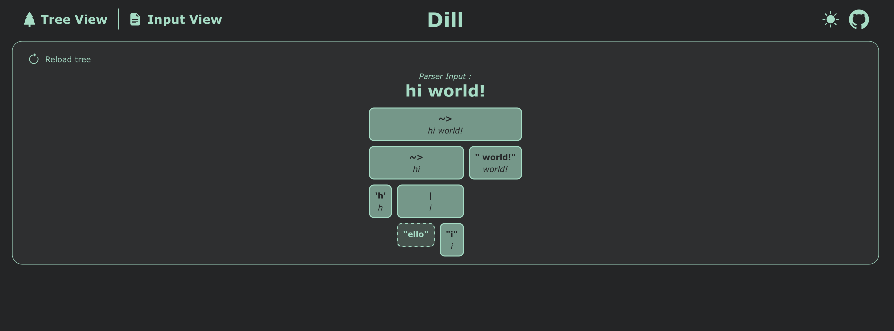
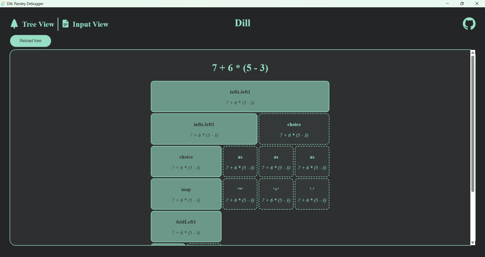

# Dill    


## What is Dill?

Dill (**Debugging Interactively in the Parsley Library**) is a cross-platform, visual, reactive and interactive debugger to be used with the _modern_ parser combinator library for Scala, [Parsley](https://github.com/j-mie6/parsley).

## How do I install it?

Dill is distributed as a binary executable and can be installed below according to your machine's operating system from the [releases](https://github.com/j-mie6/parsley-debug-app/releases/) page.

To build the `Dill` debugger on your own machine, go to [building](#building).

## Usage

You will first need to [install](#how-do-i-install-it) / [build](#building) the `Dill` debugging application onto your machine. Then once the application has started, you are ready to start sending it debug information from within `Parsley`.

First, ensure that your project has the `remote-view` project as a dependency (you will of course need to have the `Parsley` project as a dependency too).

Then import the `DillRemoteView` object from `parsley.debug`.

Then, on the parser which you would like to debug, attach the `DillRemoteView` object before the parse step.

The following scala script uses `Parsley 5.0.0-M10`:

`test.sc` :
```scala 
//> using repository sonatype-s01:snapshots

//> using dep com.github.j-mie6::parsley:5.0.0-M10
//> using dep com.github.j-mie6::parsley-debug:5.0.0-M10 
//> using dep com.github.j-mie6::parsley-debug-remote:0.1-a60d211-SNAPSHOT

import parsley.quick.*
import parsley.syntax.character.{charLift, stringLift}
import parsley.debug.combinator.*
import parsley.debug.DillRemoteView

('h' ~> ("ello" | "i") ~> " world!" ~> eof).attach(DillRemoteView).parse("hello world!1")

```

_To run this snippet, simply run_ `scala test.sc`.

You will then be able to view a representation of the abstract syntax tree generated by `Parsley`. To reload the tree from the backend, simply press the reload button in the tree view.

## Building
The frontend of the application is written using ScalaJS, and uses the `sbt` build system, the frontend compiles down to a single `JavaScript` file located in `./static`. The backend uses the `Tauri` package to host the frontend, and the `Rocket` package to host a server to receive the tree from `Parsley`. We use `npm` to manage the various packages.

### To run the project, execute `sbt start`.

This will install the node packages required to build the project, build the front and backend, and then start the generated executable.

To start the application in development mode, we use the sbt development server for the frontend, and the standard tauri development server.

### To run the project in development mode, execute 
- `sbt ~buildFrontend` to start the sbt development server.
- `sbt buildBackendDev` in a different terminal to start the tauri development server.

_This will cause a quick-reload when any of the source files are modified._

## Examples

The following images are screenshots of two example parser trees.




## Bug Reports

If you encounter a bug when using Dill, try and minimise the example of the parser input that triggers the bug. If possible, make a self contained example: this will help to identify the issue without too much issue.

Then, create a new [issue](https://github.com/j-mie6/parsley-debug-app/issues), including, if possible, screenshots and a description of the bug.

## How does it work?

- The `remote-view` backend for `parsley-debug` posts the debug tree from the parser to the Rocket HTTP server running within the `Dill` debugger.
- The Rocket server transforms and passes off a representation of the debug tree to the tauri application in `Rust`.
- The frontend then queries the tauri application for the debug tree.
- Upon receipt of the tree, the frontend renders the tree on the screen.